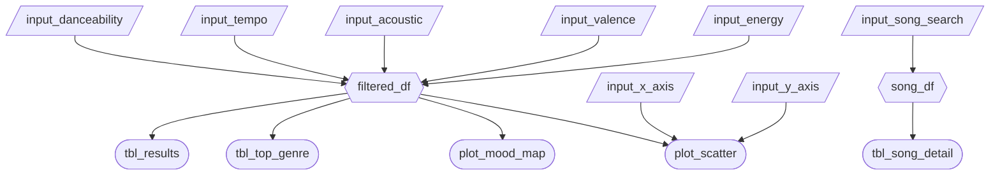

# App Specification

## Updated Job Stories

| #   | Job Story                       | Status         | Notes                         |
| --- | ------------------------------- | -------------- | ----------------------------- |
| 1   | When Alex prepares a playlist for his gym morning class on Saturdays, he needs to select the first 15 songs with energy > 0.85 and tempo 135-155 BPM, which allows him to complete the selection within 20 minutes. | ⏳ Pending | |
| 2   | When Alex creates a 'Late Night Focused Study' playlist for clients, he needs to filter 10 songs with a valence < 0.3, acoustics > 0.7, and duration < 240 seconds, so that clients receive the perfect study tracks. | ⏳ Pending | |
| 3   | When Alex wants to discover new songs for the dance floor, he needs to look at scatter plots of songs with danceability > 0.8 but popularity < 0.2, so that he can find hidden potential songs that are not yet popular but are suitable for parties, thus improving his reputation. | ⏳ Pending | |

## Component Inventory

| ID                  | Type          | Shiny widget / renderer      | Depends on                                           | Job story |
| ------------------- | ------------- | ---------------------------- | ---------------------------------------------------- | --------- |
| `input_danceability`| Input         | `ui.input_slider()`          | —                                                    | #3        |
| `input_tempo`       | Input         | `ui.input_slider()`          | —                                                    | #1        |
| `input_acoustic`    | Input         | `ui.input_slider()`          | —                                                    | #2        |
| `input_valence`     | Input         | `ui.input_slider()`          | —                                                    | #2        |
| `input_energy`      | Input         | `ui.input_slider()`          | —                                                    | #1        |
| `input_x_axis`      | Input         | `ui.input_select()`          | —                                                    | #3        |
| `input_y_axis`      | Input         | `ui.input_select()`          | —                                                    | #3        |
| `input_song_search` | Input         | `ui.input_text()`            | —                                                    | #1, #2    |
| `filtered_df`       | Reactive calc | `@reactive.calc`             | `input_danceability`, `input_tempo`, `input_acoustic`, `input_valence`, `input_energy` | #1, #2, #3 |
| `plot_mood_map`     | Output        | `@render.plot`               | `filtered_df`                                        | #2, #3    |
| `plot_scatter`      | Output        | `@render.plot`               | `filtered_df`, `input_x_axis`, `input_y_axis`        | #3        |
| `tbl_results`       | Output        | `@render.data_frame`         | `filtered_df`                                        | #1, #2    |
| `tbl_top_genre`     | Output        | `@render.data_frame`         | `filtered_df`                                        | #1, #2, #3|
| `tbl_song_detail`   | Output        | `@render.data_frame`         | `input_song_search`                                  | #1, #2    |

## Reactivity Diagram

## Calculation Details

### `filtered_df`

- **Depends on:** `input_danceability`, `input_tempo`, `input_acoustic`, `input_valence`, `input_energy`
- **Transformation:** Filters the dataset to rows where danceability, tempo, acousticness, valence, 
  and energy fall within the selected slider ranges.
- **Consumed by:** `tbl_results`, `tbl_top_genre`, `plot_mood_map`, `plot_scatter`

### `song_df`

- **Depends on:** `input_song_search`
- **Transformation:** Filters the dataset to rows where the song name contains the search string 
  (case-insensitive). Returns the matching song's audio features (tempo, danceability, valence, 
  energy, acousticness, key, liveness, loudness).
- **Consumed by:** `tbl_song_detail`

